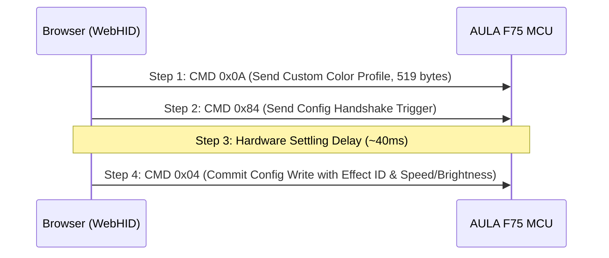

# AULA F75 WebHID Configurator & Diagnostic Toolkit
https://openaula.vercel.app/

An open-source browser-based WebHID configuration tool and reverse-engineered driver interface for the **AULA F75** 75% mechanical keyboard (Telink MCU / EVVision controller, VID `0x258A`, PID `0x010C`).

This web application operates directly over USB via the W3C WebHID API. It allows inspection, remapping, custom shortcut binding, state backing up, differential matrix analysis, and surgical recovery of corrupted key mappings (specifically physical Fn key and Windows key locks) without requiring proprietary desktop drivers.

---

## Technical Specifications & Protocol Architecture

### USB Device Identification
- **Vendor ID (VID):** `0x258A`
- **Product ID (PID):** `0x010C`
- **Interface:** WebHID Feature Reports on Report ID `6`

### WebHID Feature Report Packet Structure
Communication with the keyboard controller is handled via 519-byte Feature Reports (Report ID `6`).

#### Query Packet (Read Base Table)
To request Table 0 (Base Keymap Table):
```
Byte 0: 0x83        (Command: READ / GET FEATURE)
Byte 1..2: 0x00 0x00
Byte 3: 0x01        (Packet Count = 1)
Byte 4: 0x00        (Packet Index = 0)
Byte 5: 0x00
Byte 6: 0x02        (Payload Length = 512 bytes)
Byte 7..518: 0x00   (Padding)
```

#### Response Packet
The MCU responds with a 519-byte feature report containing 512 payload bytes starting at offset 7 (or offset 8 if Report ID byte `0x06` is prepended by the OS HID subsystem):
```
Byte 0: 0x06        (Report ID)
Byte 1: 0x83        (Echo Command)
Byte 2..6: Header metadata
Byte 7..518: 512-byte Table 0 payload
```

#### Write Packet (Write Base Table)
To commit modified keymap data back to EEPROM/flash memory:
```
Byte 0: 0x03        (Command: WRITE / SET FEATURE)
Byte 1..2: 0x00 0x00
Byte 3: 0x01        (Packet Count = 1)
Byte 4: 0x00        (Packet Index = 0)
Byte 5: 0x00
Byte 6: 0x02        (Block size = 512 bytes)
Byte 7..518:        512 bytes of Table 0 matrix data
```

---

## Memory Map & Matrix Encoding

The controller memory space consists of 1024 bytes split into two 512-byte tables:
- **Table 0 (Bytes 0–511):** Base layer matrix table (128 key records × 4 bytes each).
- **Table 1 (Bytes 512–1023):** Secondary layer / Macro / Fn layer matrix table.

### 4-Byte Key Record Encoding
Each physical key slot in Table 0 is represented by a 4-byte record:

| Byte Offset | Field Description | Range / Values |
| :--- | :--- | :--- |
| `byte[0]` | Special Function Flag | `13` (`0x0D`) = Physical Fn Key; `0` = Standard Key |
| `byte[1]` | Modifier Bitmask | Bitwise OR of modifier flags (see bitmask table below) |
| `byte[2]` | Sub-mode / Reserved | `0x00` |
| `byte[3]` | USB HID Usage ID | Logical HID Keycode (e.g., `0x04` = 'A', `0x29` = 'Esc') |

#### Modifier Bitmask Table (`byte[1]`)
- `0x01`: Left Control (`MOD_LCTRL`)
- `0x02`: Left Shift (`MOD_LSHIFT`)
- `0x04`: Left Alt (`MOD_LALT`)
- `0x08`: Left GUI / Windows (`MOD_LWIN`)
- `0x10`: Right Control (`MOD_RCTRL`)
- `0x20`: Right Shift (`MOD_RSHIFT`)
- `0x40`: Right Alt (`MOD_RALT`)
- `0x80`: Right GUI / Windows (`MOD_RWIN`)

#### Examples
- **Standard Key ('A'):** `[0, 0, 0, 0x04]`
- **Modifier Only (Left Shift):** `[0, 0x02, 0, 0]`
- **Modifier Only (Left Win):** `[0, 0x08, 0, 0]`
- **Physical Fn Key:** `[13, 0, 0, 0]` (Matrix `#53`)
- **Custom Combination (`Ctrl + Shift + C`):** `[0, 0x03, 0, 0x06]`

---

## Reverse Engineering Insights & Critical Vulnerabilities

### 1. The Fn Key Corruption Vulnerability (Matrix Position #53)
- **Problem:** The physical Fn key on the AULA F75 is located at **Matrix Position 53** (byte offset 212 in Table 0).
- **Cause:** Stock configuration requires `byte[0]` to be `13` (`[13, 0, 0, 0]`). Flashing software that treats all 128 slots as standard 1-byte HID codes will write `[0, 0, 0, 0xFF]` to matrix #53, destroying the Fn key trigger state on the firmware level.
- **Surgical Recovery Solution:** This app provides a dedicated **Surgical Fn Recovery** routine. It specifically updates matrix `#53` to `[13, 0, 0, 0]` while preserving OS modes and all other 508 bytes untouched.

### 2. Windows Key Lock & Swap Mechanics
- **Matrix Position #11:** Physical Windows Key (default: Left GUI `0xE3`, `[0, 0x08, 0, 0]`).
- **Matrix Position #17:** Physical Left Alt Key (default: Left Alt `0xE2`, `[0, 0x04, 0, 0]`).
- **Hardware Win Lock:** `Fn + Win` toggles hardware Windows Key Lock directly on the MCU.
- **OS Mode Toggle:** `Fn + W` toggles the controller between Windows and Mac mode, swapping the logical output of Matrix #11 and Matrix #17.

### 3. Matrix Checksum Calculation
Checkpoints and baseline verification use a 32-bit unsigned cumulative sum across the 1024-byte matrix buffer:
$$\text{Checksum} = \sum_{i=0}^{1023} \text{data}[i] \pmod{2^{32}}$$

---

## Key Matrix Map (AULA F75 Physical Layout)

Below is the verified mapping between physical keycaps and matrix indices:

| Matrix Index | Key Label | Category | Default HID Usage |
| :--- | :--- | :--- | :--- |
| `0` | Esc | Standard | `0x29` |
| `1` | \` ~ | Standard | `0x35` |
| `2` | Tab | Standard | `0x2B` |
| `3` | Caps Lock | Standard | `0x39` |
| `4` | Left Shift | Modifier | `0xE1` |
| `5` | Left Ctrl | Modifier | `0xE0` |
| `7` .. `61` | 1 .. 0 | Alphanumeric | `0x1E` .. `0x27` |
| `8` .. `62` | Q .. P | Alphanumeric | `0x14` .. `0x13` |
| `9` .. `57` | A .. L | Alphanumeric | `0x04` .. `0x0F` |
| `10` .. `46` | Z .. M | Alphanumeric | `0x1D` .. `0x10` |
| `11` | Left Win | Modifier | `0xE3` |
| `12` .. `78` | F1 .. F12 | Function | `0x3A` .. `0x45` |
| `17` | Left Alt | Modifier | `0xE2` |
| `35` | Spacebar | Standard | `0x2C` |
| `53` | **Fn Key** | Special (`[13, 0, 0, 0]`) | `0xFF` |
| `59` | Right Alt | Modifier | `0xE6` |
| `70` | Right Shift | Modifier | `0xE5` |
| `71` | Right Ctrl | Modifier | `0xE4` |
| `81` | Enter | Standard | `0x28` |
| `82` | Up Arrow | Navigation | `0x52` |
| `83` | Down Arrow | Navigation | `0x51` |
| `77` | Left Arrow | Navigation | `0x50` |
| `89` | Right Arrow | Navigation | `0x4F` |
| `85` | Delete | Navigation | `0x4C` |
| `86` | Page Up | Navigation | `0x4B` |
| `87` | Page Down | Navigation | `0x4E` |
| `99` | Rotary Knob | Media / Volume | Special |

---

## RGB Lighting Protocol & Architecture

The AULA F75 utilizes a SinoWealth/BYK controller with a dedicated hardware LED rendering engine capable of standalone hardware effects, persistent per-key profiles, and real-time software animation streaming.

### 1. Verified Hardware Lighting Effects

The controller firmware includes 15 built-in hardware animation shaders:

| Effect ID | Effect Name | Lighting Type | Color Capable | Firmware Description |
| :---: | :--- | :--- | :---: | :--- |
| `0` | **Off** | None | No | Disables all key LEDs |
| `1` | **Static Color** | Solid | Yes | Permanent solid illumination across all keys |
| `2` | **Single Breathing** | Dynamic | Yes | Smooth breathing fade pulse with selected palette color |
| `3` | **Rainbow Wave** | Spectrum | No | Multi-color continuous spectrum wave across the keybed |
| `4` | **Aurora Ripple** | Dynamic | Yes | Flowing ribbon aurora pattern |
| `5` | **Twinkle Stars** | Reactive | Yes | Random twinkling keys mimicking a starry night |
| `6` | **Neon Stream** | Spectrum | No | High-speed multi-colored neon bands |
| `7` | **Reactive Fade** | Reactive | Yes | Pressed keys light up and smoothly extinguish |
| `8` | **Ripple Splash** | Reactive | Yes | Expanding concentric circle waves radiating from pressed keys |
| `9` | **Starry Blink** | Reactive | No | Multi-colored reactive sparkling on keypress |
| `10` | **Sine Wave** | Dynamic | Yes | Undulating sine-wave oscillation across keyboard columns |
| `11` | **Spotlight** | Dynamic | Yes | Moving spotlight illuminating key clusters |
| `12` | **Neon Marquee** | Dynamic | Yes | Smooth traveling marquee band traversing key rows |
| `13` | **Snake Trail** | Dynamic | Yes | S-curving serpentine light trail winding through rows |
| `14` | **Spiral Rainbow** | Spectrum | No | Rotating multi-spectral vortex centered on the keyboard |

---

### 2. The 4-Step SinoWealth Hardware Commit Sequence

Committing a hardware effect or color change requires an atomic 4-step sequence to avoid race conditions with the microcontroller's internal animation loop:



1. **Step 1 — CMD `0x0A` (Color Profile Write):**
   Sends a 519-byte report defining the active color palette across 14 hardware LED groups.
2. **Step 2 — CMD `0x84` (Config Handshake Trigger):**
   Sends a configuration synchronization handshake report (`[0x84, 0, 0, 1, 0, 0x80]`), priming the MCU's internal EEPROM write registers.
3. **Step 3 — Hardware Settling Delay:**
   A mandatory 40ms pause ensuring the MCU finishes internal memory bus arbitration before accepting writes.
4. **Step 4 — CMD `0x04` (Config Write):**
   Writes back the modified 519-byte configuration payload containing `effect_id` at byte offset 17 (wire offset 18), brightness (1–4), speed (0–4), and the custom effect flag.

---

### 3. Hardware LED Memory Map & 21-Byte Register Gaps

The AULA F75 physical matrix contains 98 hardware LED positions grouped into 14 logical 7-LED clusters (21 bytes each: $7 \times 3$ RGB). To prevent corruption of adjacent matrix scanning registers, color profiles must adhere to exact 21-byte hardware zero-padding gaps:

```
[Report ID 6 Header] (Bytes 0-27)
  ├── Group 1-5   (Bytes 28-132)  : 35 LEDs (105 bytes)
  ├── GAP 1       (Bytes 133-153) : 21 bytes zero-padding (Protects Matrix Registers)
  ├── Group 6-7   (Bytes 154-195) : 14 LEDs (42 bytes)
  ├── GAP 2       (Bytes 196-216) : 21 bytes zero-padding
  ├── Group 8-11  (Bytes 217-300) : 28 LEDs (84 bytes)
  ├── GAP 3       (Bytes 301-321) : 21 bytes zero-padding
  ├── Group 12-14 (Bytes 322-384) : 21 LEDs (63 bytes)
  ├── Trailing 0s (Bytes 385-512) : 128 bytes zero-padding
  └── Terminator  (Bytes 513-514) : 0x5A, 0xA5
```

---

### 4. Per-Key Planar Canvas (CMD `0x06`)

Individual per-key illumination operates via **Planar RGB encoding** (Report ID 6, CMD `0x06`):
- **Red Plane:** Offset 7 to 132 (126 bytes)
- **Green Plane:** Offset 133 to 258 (126 bytes)
- **Blue Plane:** Offset 259 to 384 (126 bytes)

Following the planar packet upload, a CMD `0x04` configuration packet is written with `custom_flag = 0x01` and `effect_id = 0x12` (18), instructing the MCU to render the custom planar frame buffer permanently to flash.

---

### 5. High-Framerate Software Streaming Animation Engine

The software-driven animation engine streams real-time frames directly from the browser to the keyboard:
- **Hardware Shader Disablement:** On stream start, CMD `0x04` sets `custom_flag = 1, effect_id = 18`, safely pausing the MCU's internal autonomous shader loop so it does not overwrite host frames.
- **Dual Transmission:** Each frame transmits both **Planar CMD `0x06`** and **Direct CMD `0x08`** (interleaved RGB) ensuring complete compatibility across both official Aula firmwares and OpenRGB-compatible builds.
- **Keepalive Heartbeat:** Automated 600ms keepalive updates prevent the keyboard from timing out back to stock lighting while streaming is active.
- **Graceful Restoration:** Stopping the stream automatically restores the previously selected hardware effect without requiring keyboard reconnection.

---

## Application Structure & Architecture

```
aula-f75-web/
├── src/
│   ├── components/
│   │   ├── Sidebar.tsx           # Navigation sidebar with status badges
│   │   ├── Header.tsx            # Main top bar with live connection state
│   │   ├── KeyboardGrid.tsx      # Interactive 75% mechanical grid visualizer & LED preview
│   │   ├── Overview.tsx          # Main hardware matrix view & status cards
│   │   ├── KeyRemapPanel.tsx     # Remap inspector, combo encoder & preset picker
│   │   ├── RgbControlPanel.tsx   # 3-tab lighting studio (Hardware, Per-Key Canvas, Software Stream)
│   │   ├── FnWinRepairWidget.tsx # Surgical Fn/Win quick repair toolkit
│   │   ├── BackupPanel.tsx       # Baseline exporter, raw dump restore & A↔B diff tool
│   │   ├── LogViewer.tsx         # Real-time WebHID telemetry & packet console
│   │   └── LiveInputWidget.tsx   # Real-time keypress matrix detector
│   ├── services/
│   │   ├── webhid.ts             # WebHIDController class, Feature Report I/O & diffing
│   │   ├── rgbService.ts         # SinoWealth RGB controller, planar encoder & animation engine
│   │   └── inputManager.ts       # Central DOM keyboard event listener & state sync
│   ├── types/
│   │   └── hid.ts                # Key definitions, usage lookup tables, RGB presets & bitmasks
│   ├── App.tsx                   # Main layout container & tab router
│   ├── main.tsx                  # React entry point
│   └── index.css                 # Design tokens & tactile key animations
├── public/
│   └── dump/                     # Reference factory matrix JSON dumps
├── package.json
├── vite.config.ts
└── tsconfig.json
```

---

## Getting Started

### Prerequisites
- Node.js 18+ and `npm`
- A Chromium-based browser supporting the W3C WebHID API (**Google Chrome**, **Microsoft Edge**, or **Brave**)

> **Note:** Firefox and Safari currently do not support WebHID.

### Installation & Local Development

1. Clone the repository and navigate into the app folder:
   ```bash
   cd aula-f75-web
   ```

2. Install dependencies:
   ```bash
   npm install
   ```

3. Start the Vite development server:
   ```bash
   npm run dev
   ```

4. Open `http://localhost:5173` in a supported browser.

### Production Build
To create an optimized production build:
```bash
npm run build
```

---

## Usage Guide

### 1. Connecting the Device
1. Connect your AULA F75 keyboard using its USB Type-C cable.
2. Click **Connect HID** in the sidebar or overview panel.
3. Select **AULA F75** (`VID: 0x258A, PID: 0x010C`) from the browser popup.

### 2. Key Remapping
1. Click any physical key on the virtual 75% keyboard grid to select its matrix index.
2. Choose a remapping mode:
   - **Single Key Remap:** Select a standard HID keycode from organized category tabs.
   - **Custom Shortcut / Combo:** Select modifier checkboxes (`Ctrl`, `Shift`, `Alt`, `Win`) combined with a key to bind macros like `Ctrl + Shift + C`.
   - **Preset Shortcuts:** Single-click productivity presets (`Cut`, `Copy`, `Paste`, `Undo`, `Select All`).
3. Click **Apply Remap**. The application writes Table 0 to the device and verifies the write via a read-back check.

### 3. RGB Lighting & Animation Studio
Open the **RGB Studio** tab to access three dedicated lighting engines:
- **Tab 1 — Hardware Effects:** Switch between 15 built-in hardware shaders, tune speed (0–4) and brightness (1–4), and select vibrant saturated color presets with zero unwanted color bleed.
- **Tab 2 — Per-Key Canvas:** Paint individual keys on the 75% interactive visualizer, use curated Gamer / Rainbow presets, and save the custom layout permanently to keyboard flash (CMD `0x06`).
- **Tab 3 — Software Streaming:** Run dynamic software-driven animations (**Matrix Code Rain**, **Smooth Prism Sweep**, **Bioluminescent Pulse**, **Inferno Embers**) streaming directly over WebHID.

### 4. Surgical Fn & Windows Key Repair
If the physical Fn key or Windows key stops working due to corrupted keymaps:
- Open the **Backup & Recovery** tab or use the repair widget on the Overview screen.
- Click **Run Surgical Fn Recovery**. This writes `[13, 0, 0, 0]` strictly to Matrix `#53` without resetting your custom layout.
- Click **Reset Win Key** to restore Matrix `#11` to `0xE3`.

### 5. Matrix Dumps & Differential Analysis
- **Capture Baseline:** Click **Capture Factory Baseline** to download a clean `KNOWN_GOOD_FACTORY_WINDOWS.json` backup containing checksums and matrix data.
- **Diff Tool:** Capture State A (Windows mode) and State B (Mac mode) to run a byte-for-byte differential analysis across all 1024 bytes to inspect hardware mode flags.

---

## Acknowledgments & Upstream References

This project builds upon reverse-engineering research and protocol implementations from the open-source community:

- **[veysiemrah/aula-rgb-controller](https://github.com/veysiemrah/aula-rgb-controller)** by **Veysi Emrah**:
  - Foundational reverse engineering of the SinoWealth / AULA F87 / F75 lighting protocol.
  - Discovery of the 4-step hardware write sequence (`0x0A` $\to$ `0x84` $\to$ `0x04`), planar RGB memory layout (CMD `0x06`), 14-group LED gap alignments, and direct mode handshakes.
- **[rodrigost23/OpenRGB](https://gitlab.com/rodrigost23/OpenRGB)** (and the upstream [OpenRGB](https://openrgb.org/) project) by **Rodrigo Tavares**:
  - Implementation of the `SinowealthKeyboard10cController`, `SinowealthKeyboard10cDevices`, and `RGBController_SinowealthKeyboard10c` drivers for SinoWealth PID `0x010C` devices.
  - Key mapping coordinates for the 122-key physical LED buffer, Direct LED streaming command (`0x08`), and keepalive heartbeat architecture.

---

## License

MIT License. Designed for open reverse-engineering, hardware repair, and keymap configuration on AULA F75 devices.
